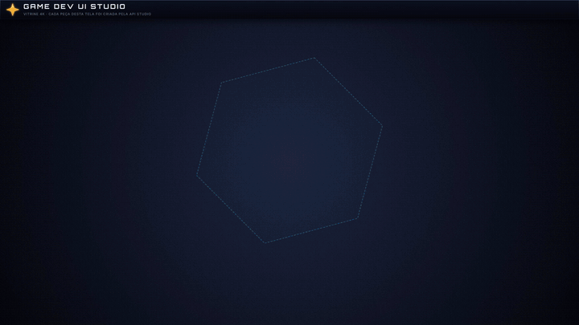

# Game Dev UI Studio

Editor de interfaces de jogo que roda direto no navegador. Monte HUDs, inventários, botões e barras numa cena 1920×1080 e exporte tudo pronto para **Unity**, **Unreal Engine** e **Godot 4**: PNGs com margens 9-slice, estados hover/pressed, SVG e um manifesto JSON com posições e dimensões.



Não precisa instalar nada, não tem login e nada sai do seu computador: o projeto fica salvo no próprio navegador.

## Recursos

- Componentes prontos: Slot, Painel, Botão, Barra, Anel, Texto e Forma
- Gradientes, bordas (sólida e chanfrada), sombra externa e interna, ícones embutidos
- Grupos, camadas com trava/visibilidade, seleção múltipla, régua, guias e smart guides
- Copiar/colar (Ctrl+C / Ctrl+V), desfazer/refazer, autosave
- Exportação 9-slice em 1×, 2K e 4K, estados de botão, SVG vetorial
- Pacote Godot 4 (`.tscn`) e manifesto para Unity e Unreal
- Script Workbench: API `Studio` para gerar layouts por código (grades, hotbars, barras de RPG)
- Interface em português e inglês

## Como usar

**Online:** abra o link do deploy.

**Local:** baixe o repositório e abra `devUI-Studio.html` no Chrome ou no Edge. Precisa de internet na primeira abertura (JSZip e fontes vêm de CDN; o CSS do Tailwind já vem embutido no HTML).

## Segurança

- Layouts `.json` de outras pessoas são validados ao abrir: campos com tipo errado voltam ao padrão, e imagens só são aceitas embutidas (`data:`), nunca por URL externa.
- **Script Workbench executa código JavaScript de verdade.** Só rode scripts que você entende. Ninguém de confiança vai pedir para você colar um script "para liberar recurso".
- Encontrou uma falha? Abra uma issue sem detalhes da exploração e peça contato privado.

## Desenvolvimento e testes

O código-fonte fica em `src/` (mapa em [src/README.md](src/README.md)). O `devUI-Studio.html` é gerado a partir dele, então edite `src/`, não o HTML. Precisa de Node 22+ e Chrome ou Edge instalados:

```
node tools/build.mjs      # monta o devUI-Studio.html a partir de src/ (e o CSS do Tailwind)
node tests/run-all.mjs    # testes headless
```

## Licença

[AGPL-3.0](LICENSE). Você pode usar, modificar e redistribuir. Se publicar uma versão modificada, inclusive como site, precisa manter a mesma licença e disponibilizar o código-fonte.
